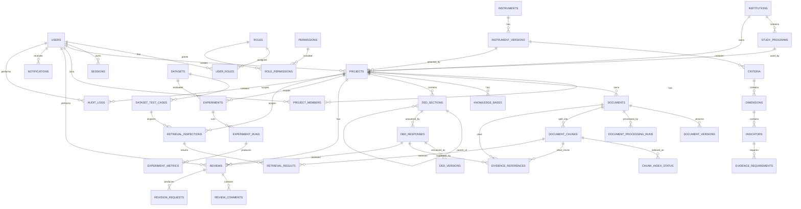

# Database ERD — Logical Model

> ERD ini adalah logical baseline. Physical SQL syntax dapat disesuaikan dengan DBMS final.

## Critical Relationship Rules

1. Semua `project-scoped resource` harus dapat ditelusuri ke `projects.id` secara langsung atau melalui parent chain yang tidak ambigu.
2. `projects.instrument_version_id` menentukan configuration instrumen yang dipakai project.
3. `DED_RESPONSES` harus dapat ditelusuri ke `DED_SECTIONS`, lalu ke criterion/dimension/indicator bila mapping tersedia.
4. `EVIDENCE_REFERENCES` harus menunjuk ke `DOCUMENTS` dan, bila berasal dari retrieval, ke `DOCUMENT_CHUNKS`.
5. `REVIEWS` tidak boleh mengubah history `DED_VERSIONS` secara destruktif.
6. `AUDIT_LOGS` tidak boleh dihapus oleh operasi CRUD biasa.
