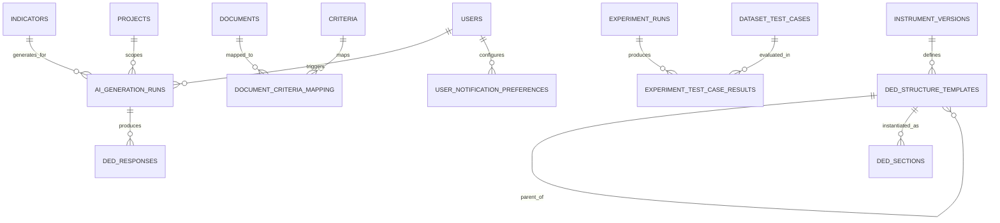

# 15 — Database Finalization: AI DED LAMEMBA

Tanggal: 28 September 2026
Sumber: 04-DATABASE-DESIGN-DATA-DICTIONARY.md + 06-DATABASE-ERD.md + 14-DETAILED-WORKFLOW.md + 12-PAGE-INVENTORY.md (Keputusan)
Step: 5 — Finalisasi database design

Dokumen ini TIDAK menggantikan 04-DATABASE-DESIGN-DATA-DICTIONARY.md.
Dokumen ini mencatat:
  1. Gap yang ditemukan setelah cross-check workflow detail vs database existing
  2. Tabel baru yang dibutuhkan
  3. Field baru/perubahan pada tabel existing
  4. Updated ERD fragment
  5. Seed data plan untuk development/skripsi
  6. Migration order

---

## A. CROSS-CHECK SUMMARY

Dokumen 04 mendefinisikan 38 tabel. Setelah cross-check dengan workflow detail (doc 14)
dan keputusan (doc 12 Section J), ditemukan:

| Kategori           | Jumlah | Detail                                        |
|--------------------|--------|-----------------------------------------------|
| Tabel existing OK  | 33     | Tidak perlu perubahan struktural               |
| Tabel perlu update | 5      | users, projects, documents, ded_responses, notifications |
| Tabel baru         | 5      | ai_generation_runs, document_criteria_mapping, experiment_test_case_results, user_notification_preferences, ded_structure_templates |
| Total final        | 43     | 38 existing + 5 baru                          |

---

## B. FIELD UPDATES PADA TABEL EXISTING

### B.1 users — tambah 2 field

| Field               | Type         | Key | Null | Description                                  |
|---------------------|--------------|-----|------|----------------------------------------------|
| must_change_password| BOOLEAN      |     | NO   | Default TRUE untuk user baru. Set FALSE setelah user ganti password pertama kali. (Workflow 7: first login) |
| avatar_url          | VARCHAR(500) |     | YES  | URL avatar user. (PEN-06: Profile page)      |

Tambahkan setelah `deleted_at`.

### B.2 projects — update status enum + tambah 1 field

Status enum harus diperluas:
- Sebelum: `PREPARATION, ACTIVE, ARCHIVED`
- Sesudah: `PLANNING, ACTIVE, COMPLETED, ARCHIVED`

Alasan: Workflow 2.1 state machine membutuhkan PLANNING (rename dari PREPARATION untuk konsistensi) dan COMPLETED.

| Field      | Type        | Key | Null | Description                                        |
|------------|-------------|-----|------|----------------------------------------------------|
| ded_status | VARCHAR(30) |     | NO   | Status keseluruhan DED project: DRAFT, IN_PROGRESS, UNDER_REVIEW, COMPLETED. Default DRAFT. (Workflow 5.4: final approval) |

Tambahkan setelah `status`.

### B.3 documents — tambah 1 field

| Field       | Type        | Key | Null | Description                                     |
|-------------|-------------|-----|------|-------------------------------------------------|
| description | TEXT        |     | YES  | Deskripsi dokumen yang diisi user saat upload. (Workflow 3.1) |

Tambahkan setelah `storage_key`.

Note: Kriteria mapping pindah ke tabel baru `document_criteria_mapping` (M:N).

### B.4 ded_responses — update status enum

Status enum harus diperluas:
- Sebelum: `DRAFT, SUBMITTED, APPROVED, REVISION_REQUIRED`
- Sesudah: `DRAFT, SUBMITTED, IN_REVIEW, APPROVED, REVISION_REQUESTED, REVISED`

Alasan: Workflow 4.3 state machine membutuhkan IN_REVIEW (reviewer picks up) dan REVISED (penyusun completes revision, before re-submit).

### B.5 notifications — tambah 2 field

| Field    | Type        | Key | Null | Description                                      |
|----------|-------------|-----|------|--------------------------------------------------|
| link     | VARCHAR(500)|     | YES  | Target URL ketika notification di-klik. (Workflow 9) |
| priority | VARCHAR(20) |     | NO   | NORMAL / HIGH. Default NORMAL. (Workflow 9)      |

Tambahkan setelah `entity_id`.

---

## C. TABEL BARU

### C.1 ai_generation_runs

Purpose: Track setiap attempt AI generation untuk DED draft. Referenced oleh `ded_responses.generation_run_id` yang sudah ada di doc 04 tapi tabel belum didefinisikan.

| Field               | Type          | Key   | Null | Description                                    |
|---------------------|---------------|-------|------|------------------------------------------------|
| id                  | UUID          | PK    | NO   | Generation run ID                              |
| project_id          | UUID          | FK    | NO   | Project scope                                  |
| indicator_id        | UUID          | FK    | NO   | Target indicator                               |
| model_name          | VARCHAR(150)  |       | NO   | Gemini model version used                      |
| prompt_version      | VARCHAR(100)  |       | YES  | Version identifier prompt template             |
| prompt_text         | TEXT          |       | YES  | Full prompt sent (for reproducibility)         |
| retrieval_method    | VARCHAR(50)   |       | NO   | SEMANTIC / BM25 / HYBRID_RRF                  |
| retrieval_config    | JSONB         |       | NO   | {topK, vectorWeight, bm25Weight, rrfK}        |
| retrieved_chunk_ids | UUID[]        |       | YES  | Ordered list of chunk IDs used in context      |
| context_token_count | INT           |       | YES  | Token count of assembled context               |
| generated_text      | TEXT          |       | YES  | Raw generated output                           |
| status              | VARCHAR(30)   |       | NO   | RUNNING / COMPLETED / FAILED                   |
| error_message       | TEXT          |       | YES  | Error detail if failed                         |
| duration_ms         | INT           |       | YES  | Total generation time in ms                    |
| created_by          | UUID          | FK    | NO   | User who triggered generation                  |
| created_at          | TIMESTAMP     |       | NO   | Timestamp                                      |

Indexes:
- `ai_generation_runs(project_id, indicator_id)`
- `ai_generation_runs(status)`

### C.2 document_criteria_mapping

Purpose: M:N join table antara documents dan criteria. Dibutuhkan karena Keputusan #3 (evidence upload via Documents page dengan kriteria mapping). Satu dokumen bisa relevan untuk multiple kriteria.

| Field        | Type      | Key    | Null | Description              |
|--------------|-----------|--------|------|--------------------------|
| document_id  | UUID      | PK/FK  | NO   | Document                 |
| criterion_id | UUID      | PK/FK  | NO   | Criterion                |
| mapped_by    | UUID      | FK     | YES  | User yang membuat mapping|
| created_at   | TIMESTAMP |        | NO   | Timestamp                |

Unique: `(document_id, criterion_id)`.

Indexes:
- `document_criteria_mapping(criterion_id)` — for filtering documents by criteria

### C.3 experiment_test_case_results

Purpose: Per-test-case results dalam satu experiment run. Workflow 6.3 menghasilkan generated answer + retrieved chunks + per-case RAGAS metrics untuk setiap test case.

| Field               | Type          | Key   | Null | Description                                    |
|---------------------|---------------|-------|------|------------------------------------------------|
| id                  | UUID          | PK    | NO   | Result ID                                      |
| run_id              | UUID          | FK    | NO   | Experiment run                                 |
| test_case_id        | UUID          | FK    | NO   | Dataset test case                              |
| generated_answer    | TEXT          |       | YES  | AI-generated answer                            |
| retrieved_chunk_ids | UUID[]        |       | YES  | Chunks retrieved for this test case            |
| retrieval_scores    | JSONB         |       | YES  | {semantic: [], bm25: [], rrf: []}              |
| context_text        | TEXT          |       | YES  | Assembled context sent to LLM                 |
| faithfulness        | DECIMAL(8,6)  |       | YES  | RAGAS Faithfulness score                       |
| answer_relevancy    | DECIMAL(8,6)  |       | YES  | RAGAS Answer Relevancy score                   |
| context_precision   | DECIMAL(8,6)  |       | YES  | RAGAS Context Precision score                  |
| context_recall      | DECIMAL(8,6)  |       | YES  | RAGAS Context Recall score                     |
| duration_ms         | INT           |       | YES  | Processing time for this test case             |
| error_message       | TEXT          |       | YES  | Error if this specific case failed             |
| created_at          | TIMESTAMP     |       | NO   | Timestamp                                      |

Unique: `(run_id, test_case_id)`.

Indexes:
- `experiment_test_case_results(run_id)`
- `experiment_test_case_results(test_case_id)`

### C.4 user_notification_preferences

Purpose: User-level notification preferences. Workflow 9 — user can configure which notification types to receive and via which channel.

| Field              | Type         | Key    | Null | Description                          |
|--------------------|--------------|--------|------|--------------------------------------|
| id                 | UUID         | PK     | NO   | Preference ID                        |
| user_id            | UUID         | FK     | NO   | User                                 |
| notification_type  | VARCHAR(80)  |        | NO   | e.g. document_uploaded, ded_submitted|
| in_app_enabled     | BOOLEAN      |        | NO   | Show in-app notification. Default TRUE|
| email_enabled      | BOOLEAN      |        | NO   | Send email. Default FALSE            |
| created_at         | TIMESTAMP    |        | NO   | Timestamp                            |
| updated_at         | TIMESTAMP    |        | NO   | Timestamp                            |

Unique: `(user_id, notification_type)`.

### C.5 ded_structure_templates

Purpose: Template/konfigurasi struktur DED yang dapat di-manage via SYS-12 (DED Structure page). Mendefinisikan template outline/section DED yang akan di-instantiate ke `ded_sections` saat project dibuat.

| Field              | Type          | Key   | Null | Description                                    |
|--------------------|---------------|-------|------|------------------------------------------------|
| id                 | UUID          | PK    | NO   | Template ID                                    |
| instrument_version_id | UUID       | FK    | NO   | Instrument version                             |
| parent_id          | UUID          | FK    | YES  | Parent template (self-referential tree)         |
| code               | VARCHAR(100)  |       | NO   | Section code                                   |
| title              | VARCHAR(500)  |       | NO   | Section title                                  |
| section_type       | VARCHAR(50)   |       | NO   | COVER, INTRO, CRITERION, APPENDIX, OTHER       |
| description        | TEXT          |       | YES  | Panduan isi section                            |
| criterion_mapping  | VARCHAR(50)   |       | YES  | Auto-map ke criterion code saat instantiate     |
| display_order      | INT           |       | NO   | Urutan                                         |
| is_required        | BOOLEAN       |       | NO   | Wajib ada di setiap project DED                |
| created_at         | TIMESTAMP     |       | NO   | Timestamp                                      |
| updated_at         | TIMESTAMP     |       | NO   | Timestamp                                      |

Unique: `(instrument_version_id, code)`.

Relationship: Saat project dibuat, system meng-copy template ini ke `ded_sections` untuk project tersebut (Workflow 2.2 step "initialize DED structure from instrument template").

---

## D. UPDATED ERD FRAGMENT (tabel baru + relasi baru)



---

## E. COMPLETE TABLE LIST (43 tables)

### Authentication & Access (6)
1. users
2. roles
3. permissions
4. user_roles
5. role_permissions
6. sessions

### Academic / Project (4)
7. institutions
8. study_programs
9. projects
10. project_members

### Instrument Configuration (6)
11. instruments
12. instrument_versions
13. criteria
14. dimensions
15. indicators
16. evidence_requirements

### Document & Knowledge Base (7)
17. documents
18. document_versions
19. document_processing_runs
20. document_chunks
21. knowledge_bases
22. chunk_index_status
23. document_criteria_mapping  ← NEW

### DED (5)
24. ded_structure_templates  ← NEW
25. ded_sections
26. ded_responses
27. ded_versions
28. evidence_references

### AI Generation (1)
29. ai_generation_runs  ← NEW

### Review (3)
30. reviews
31. review_comments
32. revision_requests

### Research (7)
33. datasets
34. dataset_test_cases
35. experiments
36. experiment_runs
37. experiment_metrics
38. experiment_test_case_results  ← NEW
39. retrieval_inspections

### Retrieval (1)
40. retrieval_results

### Notification & Audit (3)
41. notifications
42. user_notification_preferences  ← NEW
43. audit_logs

---

## F. SEED DATA PLAN (Development / Skripsi)

Untuk demo dan pengujian skripsi, seed data berikut perlu disiapkan:

### F.1 Users (4 accounts — Keputusan #1: no self-register)

| Email                  | Nama            | Role       | Password (dev)  |
|------------------------|-----------------|------------|-----------------|
| admin@lamemba.dev      | Admin Utama     | Admin      | admin123        |
| penyusun@lamemba.dev   | Penyusun DED    | DED_AUTHOR | penyusun123     |
| reviewer@lamemba.dev   | Reviewer/Asesor | REVIEWER   | reviewer123     |
| researcher@lamemba.dev | Peneliti        | RESEARCHER | researcher123   |

Note: `must_change_password = FALSE` untuk seed accounts (skip first-login flow di dev).

### F.2 Institution & Study Program

| Institution              | UPPS                    | Program Studi    | Level |
|--------------------------|-------------------------|------------------|-------|
| Universitas Demo         | Fakultas Ekonomi & Bisnis| Manajemen       | S1    |

### F.3 Project

| Nama                            | Tahun | Status | Instrument       |
|---------------------------------|-------|--------|------------------|
| Akreditasi S1 Manajemen 2026    | 2026  | ACTIVE | LAMEMBA v2024    |

Members: semua 4 user di atas.

### F.4 Instrument (LAMEMBA)

```
LAMEMBA (instrument)
└── v2024 (version, status: PUBLISHED)
    ├── Kriteria 1: Orientasi Strategis
    │   ├── Dimensi 1.1: Visi, Misi, dan Tujuan
    │   │   ├── Indikator 1.1.1
    │   │   └── Indikator 1.1.2
    │   └── Dimensi 1.2: Strategi Pencapaian
    │       └── Indikator 1.2.1
    ├── Kriteria 2: Tata Kelola
    │   └── ...
    ├── Kriteria 3: Mahasiswa
    │   └── ...
    ├── Kriteria 4: Sumber Daya Manusia
    │   └── ...
    ├── Kriteria 5: Keuangan, Sarana, dan Prasarana
    │   └── ...
    ├── Kriteria 6: Pendidikan
    │   └── ...
    └── Kriteria 7: Penelitian dan Pengabdian
        └── ...
```

Minimal: 7 kriteria, 2-3 dimensi per kriteria, 2-3 indikator per dimensi.
Evidence requirements: 1-2 per indikator.

### F.5 Sample Documents (3-5 files)

| Nama File                    | Type     | Kriteria        |
|------------------------------|----------|-----------------|
| visi-misi-fak-ekonomi.pdf    | Evidence | Kriteria 1      |
| sk-rektor-kurikulum.pdf      | Evidence | Kriteria 6      |
| profil-dosen-manajemen.xlsx  | DKPS     | Kriteria 4      |
| laporan-penelitian-2025.pdf  | Evidence | Kriteria 7      |
| template-ded-lamemba.docx   | DED      | All             |

### F.6 DED Structure Template

Sesuai UI spec (01-UI-UX-SPECIFICATION.md section 4.6):

```
1. Identitas Pengusul & UPPS       (COVER)
2. Identitas Tim Penyusun DED      (COVER)
3. Kata Pengantar & Lembar Pernyataan (INTRO)
4. Ringkasan Eksekutif              (INTRO)
5. BAB I: Pendahuluan               (INTRO)
6. BAB II: DED 7 Kriteria           (CRITERION) × 7
7. Analisis Strategi Pengembangan   (CRITERION)
8. BAB III: Penutup                 (APPENDIX)
9. Lampiran DKPS & Link Evidence    (APPENDIX)
```

### F.7 Research Seed (optional, untuk demo Research pages)

- 1 dataset dengan 5-10 test cases
- 1 completed experiment per method (LLM Only, Semantic RAG, Hybrid RAG)
- Sample RAGAS metrics

---

## G. MIGRATION ORDER

Migrasi harus dijalankan dalam urutan berikut (respecting foreign key dependencies):

```
Phase 1: Foundation
    001_create_users
    002_create_roles
    003_create_permissions
    004_create_user_roles
    005_create_role_permissions
    006_create_sessions

Phase 2: Academic
    007_create_institutions
    008_create_study_programs

Phase 3: Instrument
    009_create_instruments
    010_create_instrument_versions
    011_create_criteria
    012_create_dimensions
    013_create_indicators
    014_create_evidence_requirements
    015_create_ded_structure_templates  ← NEW

Phase 4: Project
    016_create_projects
    017_create_project_members

Phase 5: Document & KB
    018_create_documents
    019_create_document_versions
    020_create_document_processing_runs
    021_create_document_chunks
    022_create_knowledge_bases
    023_create_chunk_index_status
    024_create_document_criteria_mapping  ← NEW

Phase 6: DED
    025_create_ded_sections
    026_create_ai_generation_runs  ← NEW
    027_create_ded_responses
    028_create_ded_versions
    029_create_evidence_references

Phase 7: Review
    030_create_reviews
    031_create_review_comments
    032_create_revision_requests

Phase 8: Research
    033_create_datasets
    034_create_dataset_test_cases
    035_create_experiments
    036_create_experiment_runs
    037_create_experiment_metrics
    038_create_experiment_test_case_results  ← NEW
    039_create_retrieval_inspections
    040_create_retrieval_results

Phase 9: System
    041_create_notifications
    042_create_user_notification_preferences  ← NEW
    043_create_audit_logs

Phase 10: Seed Data
    044_seed_roles_and_permissions
    045_seed_admin_user
    046_seed_instrument_lamemba
    047_seed_ded_structure_template
    048_seed_demo_data (dev only)
```

---

## H. ADDITIONAL INDEX RECOMMENDATIONS

Beyond indexes in doc 04 section 14:

| Table                          | Index                                   | Reason                              |
|--------------------------------|-----------------------------------------|-------------------------------------|
| ai_generation_runs             | (project_id, indicator_id)              | Filter by project + indicator       |
| ai_generation_runs             | (status)                                | Find running/failed generations     |
| document_criteria_mapping      | (criterion_id)                          | Filter documents by criteria        |
| experiment_test_case_results   | (run_id)                                | Get all results for a run           |
| experiment_test_case_results   | (test_case_id)                          | Find results across runs for a case |
| user_notification_preferences  | (user_id)                               | Get user's preferences              |
| ded_structure_templates        | (instrument_version_id, display_order)  | Ordered template fetch              |
| notifications                  | (user_id, read_at, created_at)          | Unread notifications query          |
| ded_responses                  | (project_id, status)                    | Dashboard queries                   |

---

## I. STATUS ENUM REGISTRY

Central reference of all status enums across the system:

### users.status
`ACTIVE` | `INVITED` | `SUSPENDED` | `DISABLED`

### projects.status
`PLANNING` | `ACTIVE` | `COMPLETED` | `ARCHIVED`

### projects.ded_status (NEW)
`DRAFT` | `IN_PROGRESS` | `UNDER_REVIEW` | `COMPLETED`

### documents.status
`UPLOADED` | `PROCESSING` | `PROCESSED` | `FAILED` | `ARCHIVED`

### document_processing_runs.status
`QUEUED` | `RUNNING` | `COMPLETED` | `FAILED` | `CANCELLED`

### document_processing_runs.current_stage
`EXTRACTING` | `NORMALIZING` | `CHUNKING` | `EMBEDDING` | `BM25_INDEXING` | `RAG_SYNC`

### document_chunks.status
`PENDING` | `INDEXED` | `NEEDS_REVIEW` | `FAILED`

### chunk_index_status.status
`PENDING` | `INDEXED` | `FAILED`

### instrument_versions.status
`DRAFT` | `PUBLISHED` | `ARCHIVED`

### ded_responses.status (UPDATED)
`DRAFT` | `SUBMITTED` | `IN_REVIEW` | `APPROVED` | `REVISION_REQUESTED` | `REVISED`

### reviews.status
`ASSIGNED` | `IN_REVIEW` | `APPROVED` | `REVISION_REQUESTED`

### ai_generation_runs.status (NEW)
`RUNNING` | `COMPLETED` | `FAILED`

### datasets.status
`DRAFT` | `REVIEW` | `READY` | `ARCHIVED`

### dataset_test_cases.status
`DRAFT` | `NEEDS_REVIEW` | `READY`

### experiments.status
`DRAFT` | `QUEUED` | `RUNNING` | `COMPLETED` | `FAILED` | `CANCELLED`

### experiment_runs.status
`QUEUED` | `RUNNING` | `COMPLETED` | `FAILED` | `CANCELLED`

### knowledge_bases.status
`ACTIVE` | `INDEXING` | `ERROR` | `ARCHIVED`

### project_members.status
`ACTIVE` | `INVITED` | `REMOVED`

### notifications.priority (NEW)
`NORMAL` | `HIGH`

---

## J. CROSS-REFERENCE

| Document                             | Hubungan                                     |
|--------------------------------------|----------------------------------------------|
| 04-DATABASE-DESIGN-DATA-DICTIONARY.md| Original 38-table design (authoritative base)|
| 06-DATABASE-ERD.md                   | Original ERD (to be updated with new tables) |
| 14-DETAILED-WORKFLOW.md              | Workflows that drove gap analysis            |
| 12-PAGE-INVENTORY.md                 | Keputusan that changed requirements          |
| 13-PAGE-ROLE-MATRIX.md              | Role/permission mapping                       |

---

## K. NEXT STEPS

Setelah database finalized:
1. Pilih DBMS (PostgreSQL recommended — supports UUID, JSONB, array types)
2. Pilih backend framework
3. Write actual migration SQL/code
4. Implement seed data scripts
5. Setup development database
6. Begin API specification (doc 06-API-SPECIFICATION.md)
