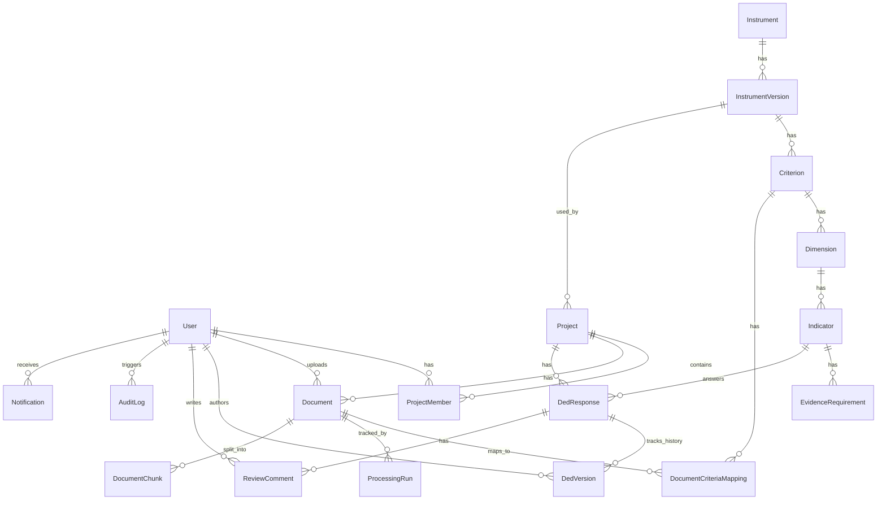

# 15 — Database Schema & Architecture: AI DED LAMEMBA

Tanggal: 28 September 2026
Sumber: `13-PAGE-ROLE-MATRIX.md`, `14-DETAILED-WORKFLOW.md`
Step: 5 — Database Design

Dokumen ini mendefinisikan skema database relasional untuk sistem AI DED LAMEMBA. Skema ini dirancang menggunakan **Prisma ORM** (dengan target PostgreSQL), yang mendukung strongly-typed relations, JSONB untuk fleksibilitas (metadata/config), serta Enum untuk state machine.

---

## A. DOMAIN ARCHITECTURE

Database dibagi menjadi 7 domain utama:
1. **Users & Auth:** Manajemen identitas dan akses.
2. **Projects & Workspaces:** Konteks pekerjaan, tim, dan lifecycle project.
3. **Instrument Configuration:** Hierarki matriks akreditasi (Kriteria → Dimensi → Indikator).
4. **Documents & Evidence:** File tracking, status RAG pipeline, dan mapping dokumen.
5. **DED Authoring & Review:** Workspace penulisan DED, versioning, dan approval flow.
6. **Research & Evaluation:** Modul riset (dataset, testing, eksperimen RAG).
7. **System & Observability:** Audit log dan notifikasi.

---

## B. MERMAID ERD DIAGRAM



---

## C. PRISMA SCHEMA DEFINITION

```prisma
datasource db {
  provider = "postgresql"
  url      = env("DATABASE_URL")
}

generator client {
  provider = "prisma-client-js"
}

// =======================================================
// 1. USERS & AUTH DOMAIN
// =======================================================

enum UserRole {
  ADMIN
  PENYUSUN
  REVIEWER
  RESEARCHER
}

enum UserStatus {
  ACTIVE
  INACTIVE
}

model User {
  id                 String    @id @default(uuid())
  email              String    @unique
  name               String
  password_hash      String
  role               UserRole
  status             UserStatus @default(ACTIVE)
  must_change_pass   Boolean   @default(true)
  created_at         DateTime  @default(now())
  updated_at         DateTime  @updatedAt

  project_members    ProjectMember[]
  uploaded_docs      Document[]
  ded_versions       DedVersion[]
  review_comments    ReviewComment[]
  notifications      Notification[]
  audit_logs         AuditLog[]
}

// =======================================================
// 2. PROJECTS & WORKSPACES DOMAIN
// =======================================================

enum ProjectStatus {
  PLANNING
  ACTIVE
  ARCHIVED
  COMPLETED
}

model Project {
  id                    String        @id @default(uuid())
  name                  String
  upps                  String
  program_type          String        // S1/S2/S3 dll.
  year                  Int
  instrument_version_id String
  status                ProjectStatus @default(PLANNING)
  created_at            DateTime      @default(now())
  updated_at            DateTime      @updatedAt

  instrument_version    InstrumentVersion @relation(fields: [instrument_version_id], references: [id])
  members               ProjectMember[]
  documents             Document[]
  ded_responses         DedResponse[]
}

model ProjectMember {
  id         String   @id @default(uuid())
  project_id String
  user_id    String
  role       UserRole // Role khusus dalam project (override/inherit dari sistem)
  created_at DateTime @default(now())

  project    Project  @relation(fields: [project_id], references: [id], onDelete: Cascade)
  user       User     @relation(fields: [user_id], references: [id], onDelete: Cascade)

  @@unique([project_id, user_id])
}

// =======================================================
// 3. INSTRUMENT CONFIGURATION DOMAIN
// =======================================================

enum InstrumentStatus {
  DRAFT
  ACTIVE
  ARCHIVED
}

model Instrument {
  id          String              @id @default(uuid())
  name        String
  description String?
  created_at  DateTime            @default(now())
  versions    InstrumentVersion[]
}

model InstrumentVersion {
  id            String           @id @default(uuid())
  instrument_id String
  name          String
  year          Int
  status        InstrumentStatus @default(DRAFT)
  created_at    DateTime         @default(now())

  instrument    Instrument       @relation(fields: [instrument_id], references: [id])
  projects      Project[]
  criteria      Criterion[]
}

model Criterion {
  id          String              @id @default(uuid())
  version_id  String
  number      Int
  name        String
  description String?

  version     InstrumentVersion   @relation(fields: [version_id], references: [id], onDelete: Cascade)
  dimensions  Dimension[]
  doc_maps    DocumentCriteriaMapping[]
}

model Dimension {
  id           String      @id @default(uuid())
  criterion_id String
  number       String      // e.g., "1.1"
  name         String
  description  String?

  criterion    Criterion   @relation(fields: [criterion_id], references: [id], onDelete: Cascade)
  indicators   Indicator[]
}

model Indicator {
  id               String               @id @default(uuid())
  dimension_id     String
  number           String               // e.g., "1.1.1"
  name             String
  description      String?
  assessment_guide String?

  dimension        Dimension            @relation(fields: [dimension_id], references: [id], onDelete: Cascade)
  evidence_reqs    EvidenceRequirement[]
  ded_responses    DedResponse[]
}

model EvidenceRequirement {
  id           String    @id @default(uuid())
  indicator_id String
  name         String
  type         String    // Document/Data
  description  String?
  is_required  Boolean   @default(true)

  indicator    Indicator @relation(fields: [indicator_id], references: [id], onDelete: Cascade)
}

// =======================================================
// 4. DOCUMENTS & EVIDENCE DOMAIN
// =======================================================

enum DocumentType {
  DED
  DKPS
  EVIDENCE
  SUPPORTING
}

enum ProcessingStatus {
  UPLOADED
  QUEUED
  EXTRACTING
  NORMALIZING
  CHUNKING
  EMBEDDING
  BM25_INDEXING
  RAG_SYNC
  PROCESSED
  FAILED
}

model Document {
  id          String           @id @default(uuid())
  project_id  String
  uploader_id String
  filename    String
  file_url    String
  size_bytes  Int
  mime_type   String
  type        DocumentType
  status      ProcessingStatus @default(UPLOADED)
  description String?
  created_at  DateTime         @default(now())
  updated_at  DateTime         @updatedAt

  project     Project          @relation(fields: [project_id], references: [id], onDelete: Cascade)
  uploader    User             @relation(fields: [uploader_id], references: [id])
  criteria_maps DocumentCriteriaMapping[]
  process_runs  ProcessingRun[]
  chunks        DocumentChunk[]
}

model DocumentCriteriaMapping {
  document_id  String
  criterion_id String

  document     Document  @relation(fields: [document_id], references: [id], onDelete: Cascade)
  criterion    Criterion @relation(fields: [criterion_id], references: [id], onDelete: Cascade)

  @@id([document_id, criterion_id])
}

model ProcessingRun {
  id           String           @id @default(uuid())
  document_id  String
  status       ProcessingStatus
  error_detail String?
  started_at   DateTime         @default(now())
  completed_at DateTime?

  document     Document         @relation(fields: [document_id], references: [id], onDelete: Cascade)
}

model DocumentChunk {
  id            String   @id @default(uuid())
  document_id   String
  chunk_index   Int
  content       String   @db.Text
  token_count   Int
  page_number   Int?
  embedding_id  String?  // Reference to Vector DB (e.g., Pinecone/PgVector ID)

  document      Document @relation(fields: [document_id], references: [id], onDelete: Cascade)
}

// =======================================================
// 5. DED AUTHORING & REVIEW DOMAIN
// =======================================================

enum DedStatus {
  DRAFT
  SUBMITTED
  IN_REVIEW
  REVISION_REQUESTED
  REVISED
  APPROVED
}

model DedResponse {
  id             String        @id @default(uuid())
  project_id     String
  indicator_id   String
  current_status DedStatus     @default(DRAFT)
  current_text   String        @db.Text
  evidence_refs  Json?         // Stores array of { chunk_id, document_id, context }
  created_at     DateTime      @default(now())
  updated_at     DateTime      @updatedAt

  project        Project       @relation(fields: [project_id], references: [id], onDelete: Cascade)
  indicator      Indicator     @relation(fields: [indicator_id], references: [id])
  versions       DedVersion[]
  comments       ReviewComment[]

  @@unique([project_id, indicator_id])
}

model DedVersion {
  id             String      @id @default(uuid())
  response_id    String
  version_number Int
  text           String      @db.Text
  evidence_refs  Json?
  status         DedStatus
  author_id      String
  created_at     DateTime    @default(now())

  response       DedResponse @relation(fields: [response_id], references: [id], onDelete: Cascade)
  author         User        @relation(fields: [author_id], references: [id])
}

enum CommentType {
  NOTE
  REVISION_REQUEST
}

model ReviewComment {
  id              String      @id @default(uuid())
  response_id     String
  author_id       String
  type            CommentType
  content         String      @db.Text
  specific_issues Json?       // Optional array of specific issues
  created_at      DateTime    @default(now())

  response        DedResponse @relation(fields: [response_id], references: [id], onDelete: Cascade)
  author          User        @relation(fields: [author_id], references: [id])
}

// =======================================================
// 6. RESEARCH & EVALUATION DOMAIN
// =======================================================

model Dataset {
  id          String      @id @default(uuid())
  name        String
  description String?
  created_at  DateTime    @default(now())
  test_cases  TestCase[]
  experiments Experiment[]
}

model TestCase {
  id              String   @id @default(uuid())
  dataset_id      String
  question        String   @db.Text
  expected_answer String   @db.Text
  evidence_refs   Json     // Ground truth chunks
  criterion       String?
  status          String   @default("IMPORTED") // IMPORTED, READY

  dataset         Dataset  @relation(fields: [dataset_id], references: [id], onDelete: Cascade)
}

model Experiment {
  id          String   @id @default(uuid())
  dataset_id  String
  name        String
  method      String   // LLM_ONLY, SEMANTIC_RAG, HYBRID_RAG
  config      Json     // { model, topK, weights, rrf_k, etc }
  status      String   @default("DRAFT") // DRAFT, QUEUED, RUNNING, COMPLETED, FAILED
  metrics     Json?    // { faithfulness, answer_relevancy, etc }
  error_msg   String?
  started_at  DateTime?
  completed_at DateTime?

  dataset     Dataset  @relation(fields: [dataset_id], references: [id])
}

// =======================================================
// 7. SYSTEM & OBSERVABILITY DOMAIN
// =======================================================

model AuditLog {
  id         String   @id @default(uuid())
  event_code String
  actor_id   String?
  payload    Json
  created_at DateTime @default(now())

  actor      User?    @relation(fields: [actor_id], references: [id], onDelete: SetNull)
}

model Notification {
  id         String   @id @default(uuid())
  user_id    String
  type       String
  title      String
  message    String   @db.Text
  link       String?
  is_read    Boolean  @default(false)
  created_at DateTime @default(now())

  user       User     @relation(fields: [user_id], references: [id], onDelete: Cascade)
}
```

## D. CATATAN IMPLEMENTASI
1. **Vector Database:** `DocumentChunk.embedding_id` adalah referensi ke Vector Store eksternal (seperti Pinecone, Qdrant, atau tabel khusus PgVector) mengingat Prisma tidak native menangani vektor kompleks tanpa ekstensi.
2. **Evidence JSONB:** Field `evidence_refs` pada DED disengaja menggunakan JSONB agar relasi reference (source citations) tidak memperumit foreign key constraint saat terjadi restore/versioning.
3. **Cascading Deletes:** Diatur pada entity hirarkis (seperti Instrument → Criteria) agar penghapusan data master (jika diperbolehkan) menjadi bersih. Namun project biasanya menggunakan *soft-delete* via `status`.
